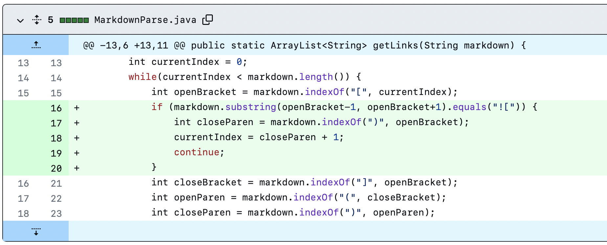
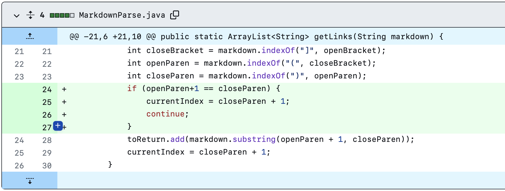
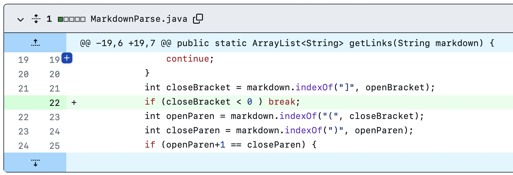

# First Code Changes
### Screenshot of the code change



### Link to the test file

[testImage.md](https://angeliazddl.github.io/markdown-parser/testImage.html)

### The Symptom

Expect output:
```
angeliaz@MacBook-Pro markdown-parser % javac MarkdownParse.java
angeliaz@MacBook-Pro markdown-parser % java MarkdownParse testImage.md
[]
```

Actual output before make changes:
```
angeliaz@MacBook-Pro markdown-parser % javac MarkdownParse.java
angeliaz@MacBook-Pro markdown-parser % java MarkdownParse testImage.md
[sunset.jpg]
```

### Description

Before the change, the code cannot test the image while it's in the test file. The image is not a link so we are supposed to not show it in the output. I add a if condition to check if the targeted link is an iamge.

# Second Code Changes
### Screenshot of the code change



### Link to the test file

[testParen.md](https://angeliazddl.github.io/markdown-parser/testParen.html)

### The Symptom
Expect output:
```
angeliaz@MacBook-Pro markdown-parser % javac MarkdownParse.java       
angeliaz@MacBook-Pro markdown-parser % java MarkdownParse testParen.md
[https://angeliazddl.github.io/markdown-parser/]
```

Actual output:
```
angeliaz@MacBook-Pro markdown-parser % javac MarkdownParse.java       
angeliaz@MacBook-Pro markdown-parser % java MarkdownParse testParen.md
[, https://angeliazddl.github.io/markdown-parser/]
```

### Description

Before the change, the code cannot skip the empty links. I add a if condition to check if the link is empty, which means nothing in parens.

# Third Code Changes
### Screenshot of the code change



### Link to the test file

[testBracket.md](https://angeliazddl.github.io/markdown-parser/testBracket.html)

### The Symptom

Expect output:
```
angeliaz@MacBook-Pro markdown-parser % javac MarkdownParse.java       
angeliaz@MacBook-Pro markdown-parser % java MarkdownParse testBracket.md
[https://angeliazddl.github.io/markdown-parser/]
```

Actual output:

```
angeliaz@MacBook-Pro markdown-parser % javac MarkdownParse.java       
angeliaz@MacBook-Pro markdown-parser % java MarkdownParse testBracket.md
Exception in thread "main" java.lang.OutOfMemoryError: Java heap space
        at java.base/java.lang.StringLatin1.newString(StringLatin1.java:766)
        at java.base/java.lang.String.substring(String.java:2708)
        at MarkdownParse.getLinks(MarkdownParse.java:19)
        at MarkdownParse.main(MarkdownParse.java:30)
```

### Description

Before the change, the code will run an error if there is only an open bracket following the last link. However we are supposed to return the links before that in the output. To fix this symptom, I add a if condition to check if there is a close bracket following the open bracket.
